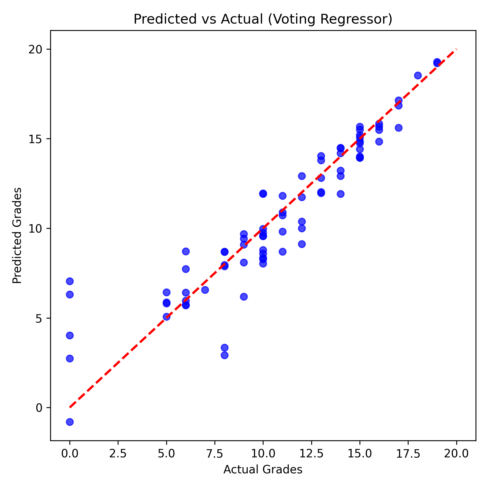

# 🎓 Student Performance Prediction Using Machine Learning

[](https://www.python.org/downloads/)
[](https://scikit-learn.org/)
[](LICENSE)

A machine learning research project that predicts student academic performance using ensemble learning techniques. This project demonstrates the application of various regression models to forecast final grades based on demographic, social, and academic features.

---

## 📊 Project Overview

This research investigates whether machine learning can effectively predict student final grades using the **UCI Student Performance Dataset**. We compare multiple regression algorithms and demonstrate that **ensemble methods** achieve superior predictive performance.

### Key Results

| Model | RMSE | R² Score |
|-------|------|----------|
| Linear Regression | 2.04 | 0.80 |
| Decision Tree | 2.12 | 0.78 |
| Random Forest (Tuned) | 1.83 | 0.84 |
| Gradient Boosting | 1.84 | 0.84 |
| **Voting Regressor** | **1.78** | **0.85** |

> 🏆 The Voting Regressor ensemble achieved the best performance with **85% explained variance**.

---

## 📁 Project Structure

```
Research Paper/
├── data/
│   └── student-mat.csv          # UCI Student Performance Dataset
├── notebooks/
│   └── Experiment.ipynb         # Jupyter notebook with experiments
├── results/
│   ├── Feature_Importance.png   # Feature importance visualization
│   ├── Predicted_vs_Actual.png  # Prediction scatter plot
│   ├── Model_Comparison.csv     # Model metrics comparison
│   └── Student_Performance_Research_Paper_Pro.pdf  # Generated PDF
├── main.py                      # Main ML training script
└── README.md                    # This file
```

---

## 🚀 Getting Started

### Prerequisites

Ensure you have Python 3.8+ installed along with the following packages:

```bash
pip install pandas numpy matplotlib seaborn scikit-learn reportlab
```

### Running the ML Pipeline

1. **Train models and generate visualizations:**
   ```bash
   python main.py
   ```
   This will:
   - Load and preprocess the dataset
   - Engineer new features
   - Train 5 regression models
   - Perform hyperparameter tuning on Random Forest
   - Generate comparison metrics and visualizations

2. **Generate the research paper PDF:**
   ```bash
   cd results
   python app.py
   ```
   This creates a professional PDF document with all results.

---

## 🔬 Methodology

### Dataset
- **Source:** UCI Machine Learning Repository - Student Performance Dataset
- **Records:** 395 students
- **Features:** 33 attributes (demographic, social, academic)
- **Target:** Final grade (G3) on 0-20 scale

### Feature Engineering
We created several derived features to improve model performance:

| Feature | Description |
|---------|-------------|
| `avg_prev_grades` | Mean of G1 and G2 grades |
| `study_efficiency` | Ratio of study time to absences |
| `health_factor` | Combined health and alcohol consumption score |

### Models Implemented
1. **Linear Regression** - Baseline model
2. **Decision Tree Regressor** - Non-linear baseline
3. **Random Forest** - Ensemble with GridSearchCV tuning
4. **Gradient Boosting** - Sequential ensemble method
5. **Voting Regressor** - Meta-ensemble combining LR, RF, and GBR

### Hyperparameter Tuning
Random Forest was optimized using:
- **GridSearchCV** with **Repeated K-Fold** cross-validation (5 folds × 3 repeats)
- Parameters tuned: `n_estimators`, `max_depth`, `min_samples_split`, `min_samples_leaf`

---

## 📈 Results

### Feature Importance
The top predictive features identified by Random Forest:


### Model Performance
Predicted vs Actual grades using the Voting Regressor:



---

## 📄 Generated Outputs

| File | Description |
|------|-------------|
| `Feature_Importance.png` | Bar chart of feature importance scores |
| `Predicted_vs_Actual.png` | Scatter plot of predictions vs actual values |
| `Model_Comparison.csv` | CSV with RMSE and R² for all models |
| `Student_Performance_Research_Paper_Pro.pdf` | Professional PDF research paper |

---

## 🛠️ Technologies Used

- **Python 3.10+**
- **pandas** - Data manipulation
- **NumPy** - Numerical computing
- **scikit-learn** - Machine learning models
- **Matplotlib & Seaborn** - Data visualization
- **ReportLab** - PDF generation

---

## 📚 References

1. Cortez, P., & Silva, A. (2008). Using Data Mining to Predict Secondary School Student Performance. *UCI ML Repository*.
2. Pedregosa, F., et al. (2011). Scikit-learn: Machine Learning in Python. *JMLR*, 12, 2825-2830.
3. Friedman, J., Hastie, T., & Tibshirani, R. (2001). *The Elements of Statistical Learning*. Springer.

---

## 👤 Author

**Muhammad Muneeb Rashid**  
Course: AI & Data Science

---

## 📝 License

This project is for educational and research purposes.
